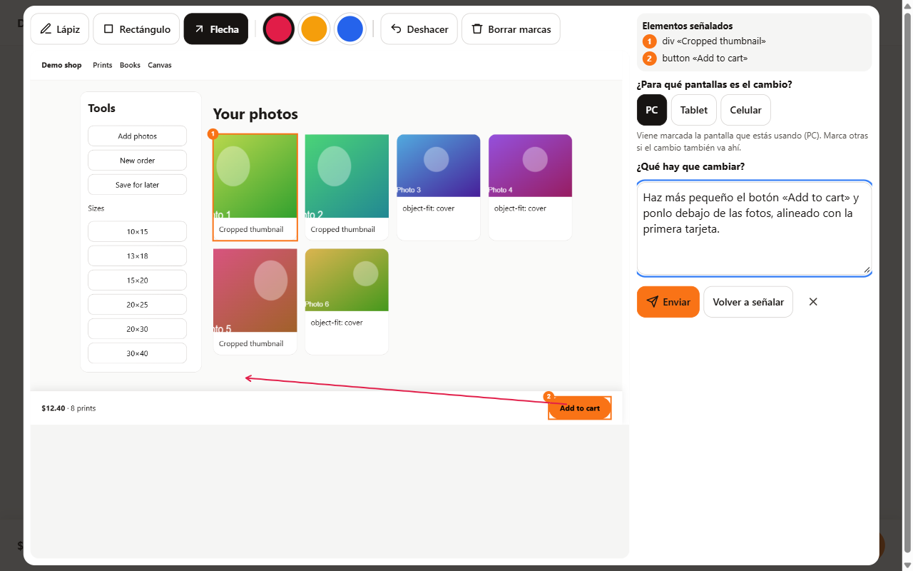
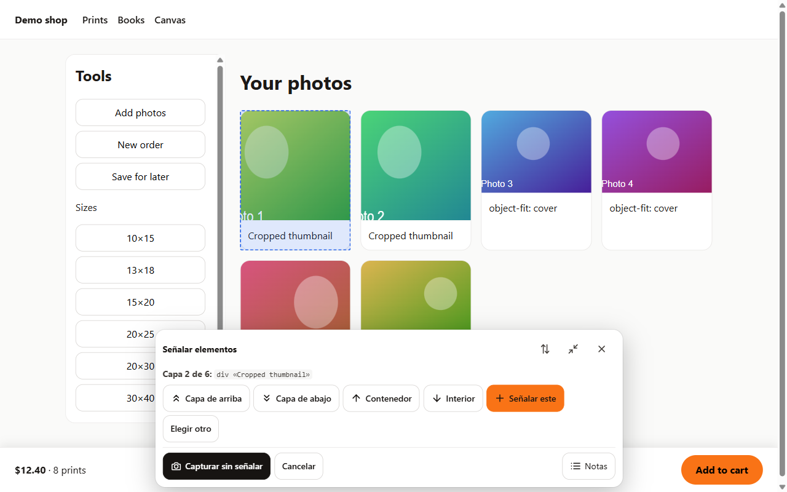
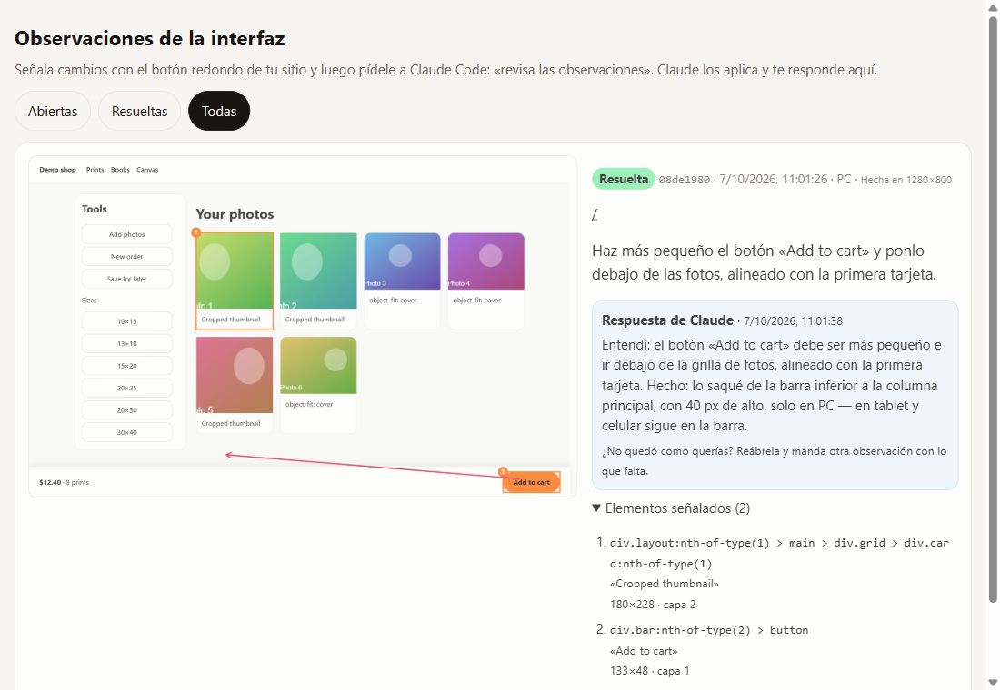

# UI Feedback para Claude Code

**Señala cosas en tu sitio y di qué cambiar. Claude Code lo aplica y te responde en cada observación.**

[English](README.md)



Explicarle a una IA "el botón de abajo, no, el otro, un poco más a la izquierda" es lento. Con esta skill abres tu sitio, tocas el elemento, marcas la captura, escribes el cambio y lo envías. Luego le dices a Claude Code **«revisa las observaciones»**: lee cada observación con su captura, encuentra el código, hace el cambio para las pantallas que elegiste y te responde en la observación qué entendió y qué hizo.

## Qué incluye

- **Un botón flotante en tu sitio, solo para ti.** Los visitantes nunca lo ven ni descargan su código.
- **Señalar capa por capa**, como el inspector del navegador: tocas un elemento y te mueves a la capa de arriba o de abajo, a su contenedor o a su interior, y señalas uno o varios.
- **Captura y marcas**: los elementos señalados salen numerados; además puedes dibujar con lápiz, rectángulo o flecha en tres colores.
- **Pantallas**: indicas si el cambio es para PC, tablet, celular o varias. La que estás usando viene marcada.
- **Lo que recibe Claude**: tu comentario, la captura marcada y, de cada elemento, su selector CSS, texto, tamaño, estilos y nombres de componentes (React, incluidos los Server Components, Vue, Svelte y Angular en modo desarrollo).
- **Una página de observaciones** en `/api/ui-feedback?view` con cada observación, su captura y la respuesta de Claude. Desde ahí puedes resolverlas, reabrirlas o borrarlas.
- **Un pequeño CLI** (`scripts/ui-feedback.mjs`) para listar y responder observaciones, con o sin Claude.
- Interfaz en español e inglés.





## Instalación

Necesitas [Claude Code](https://claude.com/claude-code), Node.js 18.17 o más reciente y un proyecto web con parte de servidor (rutas de API, SSR o servidor de desarrollo). Revisa los [stacks compatibles](#stacks-compatibles).

### Como plugin (recomendado)

En Claude Code:

```
/plugin marketplace add saminsoo/ui-feedback
/plugin install ui-feedback@saminsoo
```

### Solo la skill

Copia la carpeta de la skill en tu carpeta de skills: `~/.claude/skills/` para todos tus proyectos, o `.claude/skills/` dentro de un proyecto.

```bash
git clone https://github.com/saminsoo/ui-feedback
cp -r ui-feedback/plugins/ui-feedback/skills/ui-feedback ~/.claude/skills/
```

### Luego, en tu proyecto

Pídele a Claude Code: **«instala la herramienta de observaciones en este proyecto»**.

Claude revisa tu stack y luego:

- copia tres archivos en tu proyecto (el widget, el endpoint y el almacenamiento en archivos) y el CLI;
- agrega la ruta de API y el lanzador;
- instala `html2canvas-pro`;
- agrega `.ui-feedback/` al `.gitignore`;
- envía una observación de prueba para comprobar que funciona.

No se instala nada global y no hace falta ninguna cuenta ni servicio externo.

## Uso diario

1. Abre tu sitio en desarrollo, o el sitio publicado una vez activado (ver abajo).
2. Toca el botón redondo de la esquina inferior, toca un elemento, recorre sus capas y pulsa **Señalar este**. Repite para señalar más.
3. Pulsa **Capturar y comentar**: marca la captura, elige las pantallas y escribe qué hay que cambiar. Pulsa **Enviar**.
4. En Claude Code: **«revisa las observaciones»**.
5. Revisa el resultado en tu sitio y lee la respuesta de Claude en la página de observaciones. ¿No quedó como querías? Reabre la observación y envía otra con lo que falta.

Si una observación no está clara, Claude la deja abierta y te pregunta en ella en vez de adivinar.

## En un sitio publicado (staging)

En producción la herramienta está **apagada** hasta que configures una clave:

1. `node scripts/ui-feedback.mjs key` genera una clave aleatoria.
2. Ponla como `UI_FEEDBACK_KEY` en las variables de entorno del servidor y vuelve a desplegar.
3. Abre `https://tu-sitio/api/ui-feedback?enable=<clave>` una vez en cada navegador que uses. Una cookie te mantiene dentro 30 días. `?disable` te saca.
4. Para que Claude lea las observaciones desde tu computadora, agrega `UI_FEEDBACK_URL=https://tu-sitio/api/ui-feedback` y `UI_FEEDBACK_KEY=<clave>` a tu `.env.local` (ignorado por git).

Si tu sitio ya tiene inicio de sesión para administradores, puedes dejarlos entrar con una función `isAllowed` en lugar del enlace.

Las observaciones se guardan como archivos en `.ui-feedback/`, así que el servidor necesita un disco que sobreviva a los despliegues, como un VPS o un volumen de Docker. En hostings serverless (Vercel, Netlify, Cloudflare) escribe un pequeño almacenamiento para tu base de datos: son seis funciones. La [guía de instalación](plugins/ui-feedback/skills/ui-feedback/references/install.md) explica cómo (en inglés).

## El CLI

Se copia en tu proyecto como `scripts/ui-feedback.mjs`. No tiene dependencias y funciona sin Claude:

```bash
node scripts/ui-feedback.mjs pull                        # observaciones abiertas, con sus capturas
node scripts/ui-feedback.mjs show <id>                   # una observación
node scripts/ui-feedback.mjs reply <id> "Hecho: ..."     # responder y resolver
node scripts/ui-feedback.mjs reply <id> "Pregunta: ..." --keep-open
node scripts/ui-feedback.mjs resolve <id...>             # o: reopen <id...>
node scripts/ui-feedback.mjs key                         # una clave aleatoria nueva
```

Lee la carpeta local `.ui-feedback/`, o el sitio publicado cuando están configuradas `UI_FEEDBACK_URL` y `UI_FEEDBACK_KEY`.

## Seguridad y privacidad

- **Los visitantes nunca lo ven.** El lanzador primero pregunta al endpoint y solo entonces descarga el widget.
- **Cerrado en producción por defecto.** Sin `UI_FEEDBACK_KEY` el endpoint responde 404. La cookie de activación es `HttpOnly` y `SameSite=Lax`, y guarda un HMAC de la clave, no la clave. El CLI envía la clave como token Bearer.
- **Tus datos se quedan en tu servidor.** Las capturas se hacen en el navegador y se guardan en tu propio servidor. No se envía nada a terceros.
- **Entradas y salidas protegidas.** Las observaciones se validan y tienen límite de tamaño (8 MB por captura por defecto). La página de observaciones escapa todo el contenido y verifica el `Origin` de sus formularios. El widget nunca usa `innerHTML` y vive en un Shadow DOM, así que tu CSS no lo rompe y él no rompe el tuyo.
- **En desarrollo** el endpoint está abierto para quien pueda llegar a tu servidor de desarrollo, igual que el resto de ese servidor.

## Stacks compatibles

| Stack | Cómo |
|---|---|
| Next.js (App Router) | Plantillas listas de ruta y lanzador |
| Next.js (Pages Router) | Ruta de API + `_app` |
| Remix / React Router 7 | Resource route + `root.tsx` |
| SvelteKit | `+server.js` + layout raíz |
| Nuxt 3 | Ruta de servidor + plugin de cliente |
| Astro (SSR) | Endpoint de API + script en el layout |
| Express o cualquier servidor Node | `toNodeMiddleware` |
| SPA con Vite (React, Vue, Svelte) | Plugin del servidor de desarrollo de Vite |
| HTML simple | Un `<script type="module">` |

El endpoint usa la API estándar `Request`/`Response`, así que Hono, Bun y Deno también funcionan. La [guía de instalación](plugins/ui-feedback/skills/ui-feedback/references/install.md) tiene los detalles de cada uno.

## Prueba la demo

No hace falta instalar nada: la demo no tiene dependencias (carga `html2canvas-pro` desde un CDN, así que necesita internet).

```bash
git clone https://github.com/saminsoo/ui-feedback
cd ui-feedback
npm run demo
```

Abre http://localhost:4321/?lang=es. Las observaciones se guardan en `demo/.ui-feedback/` y puedes leerlas con `node plugins/ui-feedback/skills/ui-feedback/scripts/ui-feedback.mjs --dir demo/.ui-feedback pull`.

Pruebas: `npm test`.

## Limitaciones

- La captura es una copia de la página redibujada por `html2canvas-pro`, no una grabación real de la pantalla. CSS poco común, imágenes de otros dominios sin CORS, iframes y videos pueden verse distintos. Claude se basa en los datos de los elementos; la captura da contexto. Para capturas exactas al píxel existe la opción `tabCapture`, que usa el permiso de compartir pantalla del navegador.
- Necesita parte de servidor. Un sitio totalmente estático necesita un pequeño backend o una función serverless con un almacenamiento propio.
- Los nombres de componentes y archivos fuente vienen de las compilaciones de desarrollo. En producción Claude trabaja con selectores, textos y clases.

## Estructura del repositorio

```
.claude-plugin/marketplace.json        el marketplace del plugin
plugins/ui-feedback/
  .claude-plugin/plugin.json
  skills/ui-feedback/
    SKILL.md                           lo que sigue Claude para instalar y para revisar
    references/                        guía de instalación por stack, guía de revisión, formato de la observación
    templates/                         widget, endpoint, almacenamiento en archivos, ruta y lanzador de Next.js
    scripts/ui-feedback.mjs            el CLI
demo/                                  una pequeña tienda de ejemplo para probarlo
tests/                                 pruebas del endpoint y del CLI (node --test)
```

## Licencia

[MIT](LICENSE)
