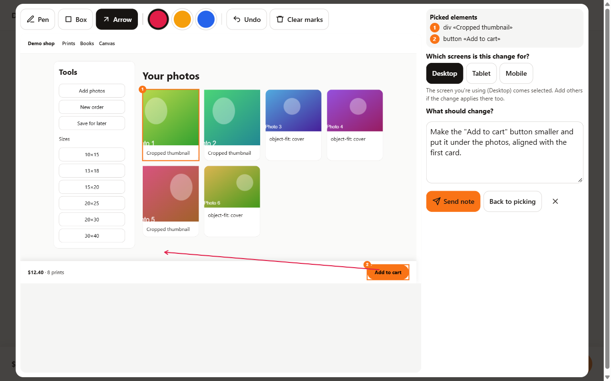
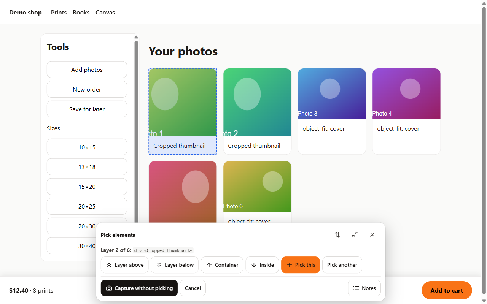
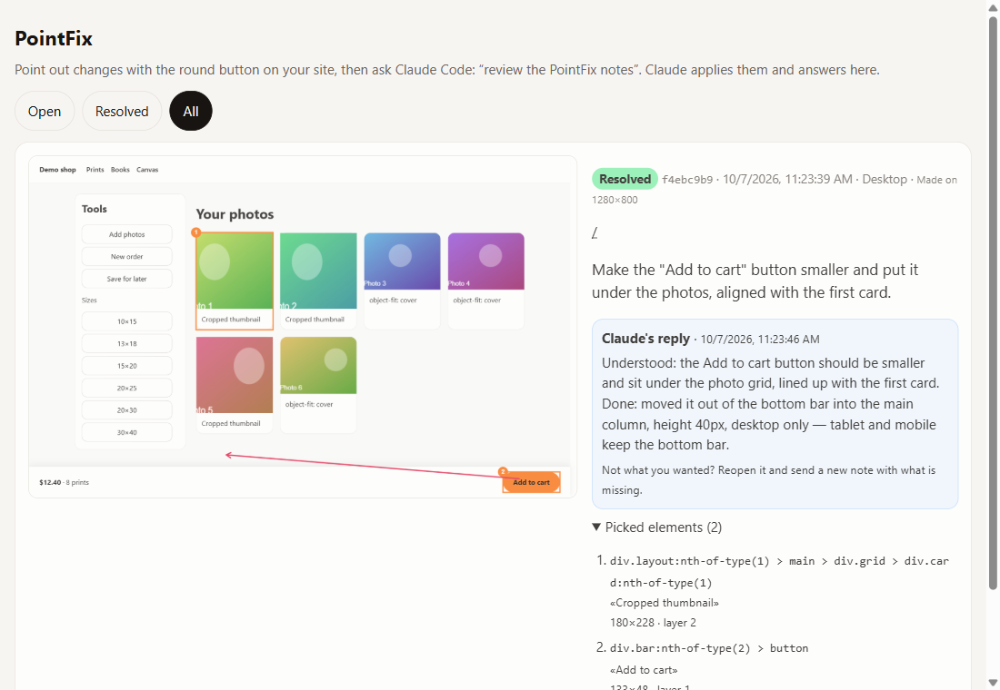

# PointFix for Claude Code

**Point at things on your site and say what to change. Claude Code applies it and answers on each note.**

[Español](README.es.md)



Telling an AI "the button at the bottom, no, the other one, a bit to the left" is slow. With this skill you open your site, click the element, mark the screenshot, write the change, and send it. Then you tell Claude Code **"review the PointFix notes"**: it reads every note with its screenshot, finds the code, makes the change for the screens you chose, and replies on the note with what it understood and what it did.

## What you get

- **A floating button on your site, only for you.** Visitors never see it or download its code.
- **Layer-by-layer picking**, like the browser inspector: click an element, then move to the layer above or below, its container or what's inside, and pick one or several.
- **Screenshot and marks**: picked elements come numbered; add a pen, box or arrow in three colors.
- **Screens**: say whether the change is for desktop, tablet, mobile or several. The one you're using comes selected.
- **What Claude gets**: your comment, the marked screenshot and, for each element, its CSS selector, text, size, styles and component names (React, including Server Components, Vue, Svelte, Angular in dev builds).
- **A notes page** at `/api/pointfix?view` with every note, its screenshot and Claude's reply. You can resolve, reopen or delete notes there.
- **A small CLI** (`scripts/pointfix.mjs`) to list and answer notes, with or without Claude.
- English and Spanish interface.





## Install

You need [Claude Code](https://claude.com/claude-code), Node.js 18.17 or newer, and a web project with a server part (API routes, SSR or a dev server). See the [supported stacks](#supported-stacks).

### As a plugin (recommended)

In Claude Code:

```
/plugin marketplace add saminsoo/pointfix
/plugin install pointfix@saminsoo
```

### Only the skill

Copy the skill folder into your skills directory: `~/.claude/skills/` for all your projects, or `.claude/skills/` inside one project.

```bash
git clone https://github.com/saminsoo/pointfix
cp -r pointfix/plugins/pointfix/skills/pointfix ~/.claude/skills/
```

### Then, in your project

Ask Claude Code: **"install PointFix in this project"**.

Claude looks at your stack and then:

- copies three files into your project (the widget, the endpoint and the file store) plus the CLI;
- adds the API route and the launcher;
- installs `html2canvas-pro`;
- adds `.pointfix/` to `.gitignore`;
- sends a test note to check it works.

Nothing is installed globally and there's no account or external service.

## Everyday use

1. Open your site in development, or the deployed site once it's activated (see below).
2. Click the round button in the bottom corner, click an element, move through its layers and press **Pick this**. Repeat to pick more.
3. Press **Capture & comment**: mark the screenshot, choose the screens and write what should change. **Send note**.
4. In Claude Code: **"review the PointFix notes"**.
5. Check the result on your site and read Claude's reply on the notes page. Not what you wanted? Reopen the note and send a new one with what's missing.

If a note is unclear, Claude leaves it open and asks a question on it instead of guessing.

## On a deployed site (staging)

In production the feature is **off** until you set a key:

1. `node scripts/pointfix.mjs key` prints a random key.
2. Set it as `POINTFIX_KEY` in the server's environment and redeploy.
3. Open `https://your-site/api/pointfix?enable=<key>` once in each browser you use. A cookie keeps you in for 30 days. `?disable` logs you out.
4. So Claude can read the notes from your machine, add `POINTFIX_URL=https://your-site/api/pointfix` and `POINTFIX_KEY=<key>` to your local `.env.local` (git-ignored).

If your site already has admin logins, you can let admins in with an `isAllowed` check instead of the link.

Notes are saved as files in `.pointfix/`, so the server needs a disk that survives deploys, like a VPS or a Docker volume. On serverless hosts (Vercel, Netlify, Cloudflare) write a small store for your database: it's six functions. The [install guide](plugins/pointfix/skills/pointfix/references/install.md) explains how.

## The CLI

It's copied into your project as `scripts/pointfix.mjs`. It has no dependencies and works without Claude:

```bash
node scripts/pointfix.mjs pull                       # open notes, with their screenshots
node scripts/pointfix.mjs show <id>                  # one note
node scripts/pointfix.mjs reply <id> "Done: ..."     # answer and resolve
node scripts/pointfix.mjs reply <id> "Question: ..." --keep-open
node scripts/pointfix.mjs resolve <id...>            # or: reopen <id...>
node scripts/pointfix.mjs key                        # a new random key
```

It reads the local `.pointfix/` folder, or the deployed site when `POINTFIX_URL` and `POINTFIX_KEY` are set.

## Security and privacy

- **Visitors never see it.** The launcher asks the endpoint first and only then downloads the widget.
- **Closed in production by default.** Without `POINTFIX_KEY` the endpoint answers 404. The activation cookie is `HttpOnly` and `SameSite=Lax`, and it holds an HMAC of the key, not the key itself. The CLI sends the key as a Bearer token.
- **Your data stays on your server.** Screenshots are taken in the browser and saved on your own server. Nothing is sent to third parties.
- **Hardened input and output.** Notes are validated and size-limited (8 MB per screenshot by default). The notes page escapes everything and checks the `Origin` of its forms. The widget never uses `innerHTML` and lives in a Shadow DOM, so your CSS can't break it and it can't break yours.
- **In development** the endpoint is open to anyone who can reach your dev server, like the rest of your dev server.

## Supported stacks

| Stack | How |
|---|---|
| Next.js (App Router) | Ready-made route and launcher templates |
| Next.js (Pages Router) | API route + `_app` |
| Remix / React Router 7 | Resource route + `root.tsx` |
| SvelteKit | `+server.js` + root layout |
| Nuxt 3 | Server route + client plugin |
| Astro (SSR) | API endpoint + layout script |
| Express or any Node server | `toNodeMiddleware` |
| Vite SPA (React, Vue, Svelte) | Vite dev-server plugin |
| Plain HTML | One `<script type="module">` |

The endpoint uses the standard `Request`/`Response` API, so Hono, Bun and Deno work too. The [install guide](plugins/pointfix/skills/pointfix/references/install.md) has the details for each one.

## Try the demo

No install needed: the demo has no dependencies (it loads `html2canvas-pro` from a CDN, so it needs internet).

```bash
git clone https://github.com/saminsoo/pointfix
cd pointfix
npm run demo
```

Open http://localhost:4321 (add `?lang=es` for Spanish). Notes are saved in `demo/.pointfix/`, and you can read them with `node plugins/pointfix/skills/pointfix/scripts/pointfix.mjs --dir demo/.pointfix pull`.

Tests: `npm test`.

## Limitations

- The screenshot is a copy of the page redrawn by `html2canvas-pro`, not a real screen recording. Unusual CSS, cross-origin images without CORS, iframes and videos can look different. The element data is what Claude relies on; the screenshot gives context. For pixel-exact captures there's an opt-in `tabCapture` option, which uses the browser's screen-share prompt.
- It needs a server part. A purely static site needs a small backend or a serverless function with a custom store.
- Component names and source files come from development builds. In production builds Claude works from selectors, text and classes.

## Repository layout

```
.claude-plugin/marketplace.json        the plugin marketplace
plugins/pointfix/
  .claude-plugin/plugin.json
  skills/pointfix/
    SKILL.md                           what Claude follows to install and to review
    references/                        install guide per stack, review guide, note format
    templates/                         widget, endpoint, file store, Next.js route and launcher
    scripts/pointfix.mjs            the CLI
demo/                                  a small shop page to try it
tests/                                 endpoint and CLI tests (node --test)
```

## License

[MIT](LICENSE)
